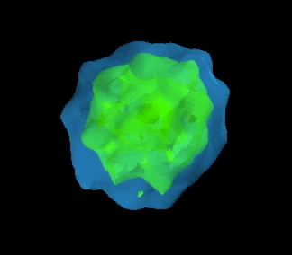
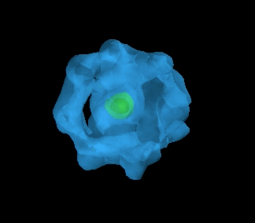

Here we showcase how the Active Learning algorithm relaxes 18 atom AuPd clusters through their global configuration space.
That is, starting from essentially arbitrary positions within the unit cell, the clusters eventually find their global minima.

Iteration 1, 2
 

Iteration 3, 4
 

 

Iteration 5

  

