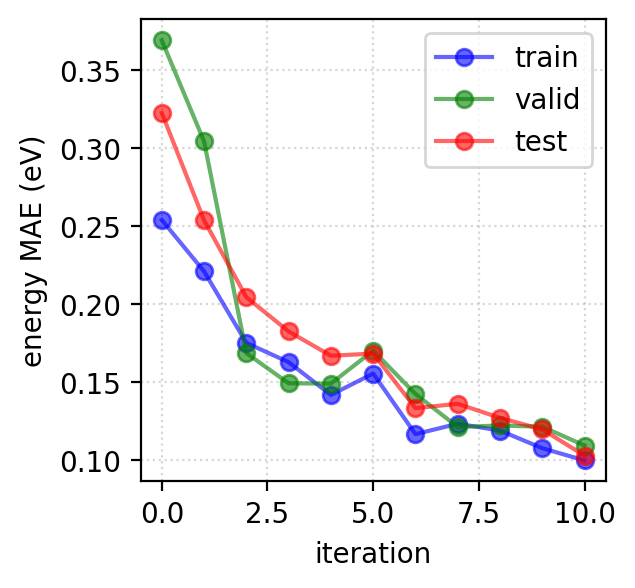
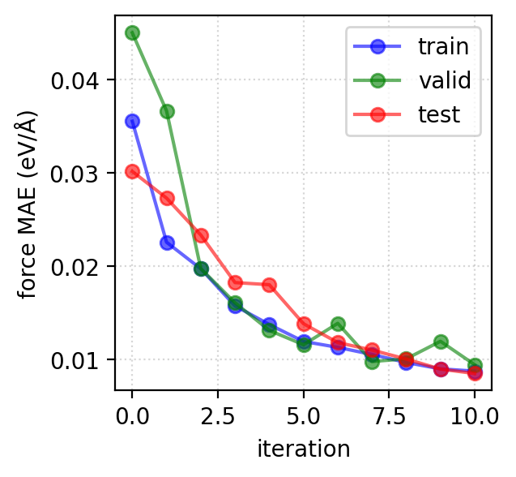
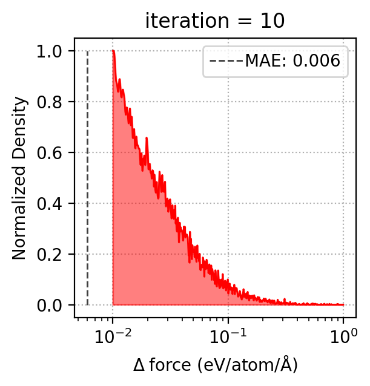
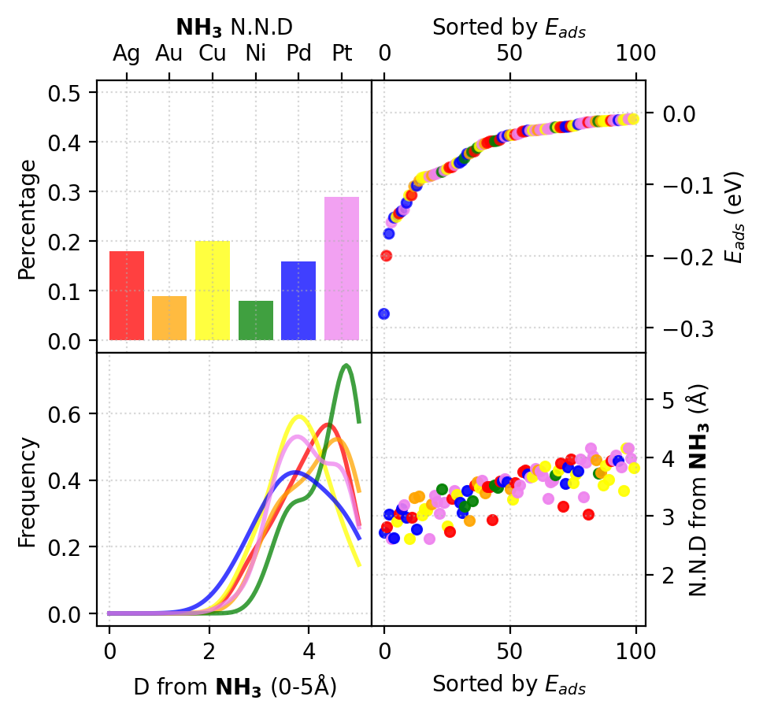

## Here we showcase how the Active-Learning loop can find optimial adsorption sites on randomized clusters.
These states are comprised of multiple elements, and thus their composition, size, stoichiometry all together multiply the state space.
To explore spaces like this automatically, we employ the AL algorithm with minimal adjustment.
This time the neural networks are encoded with SchentPack (https://github.com/atomistic-machine-learning/schnetpack)

The genetic algorithm is encoded with atomic simulations environment, as is the database archetecture (https://gitlab.com/ase/ase)

### Here we see the energy and force predictions improving over global loops.

  

  

### And here is an in-depth analysis into the final iteration's preformance.

  

  

  

  

  

  

### Finally we showcase some analysis into adsorption energy trends for each adsorbate.

  

  

  

  

  

