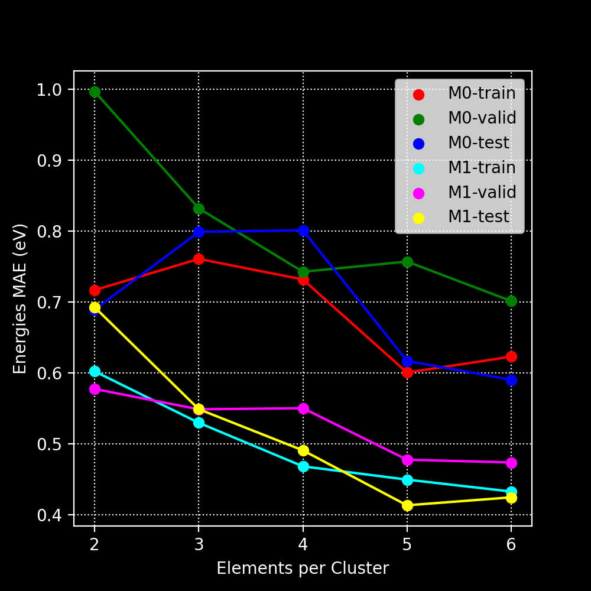
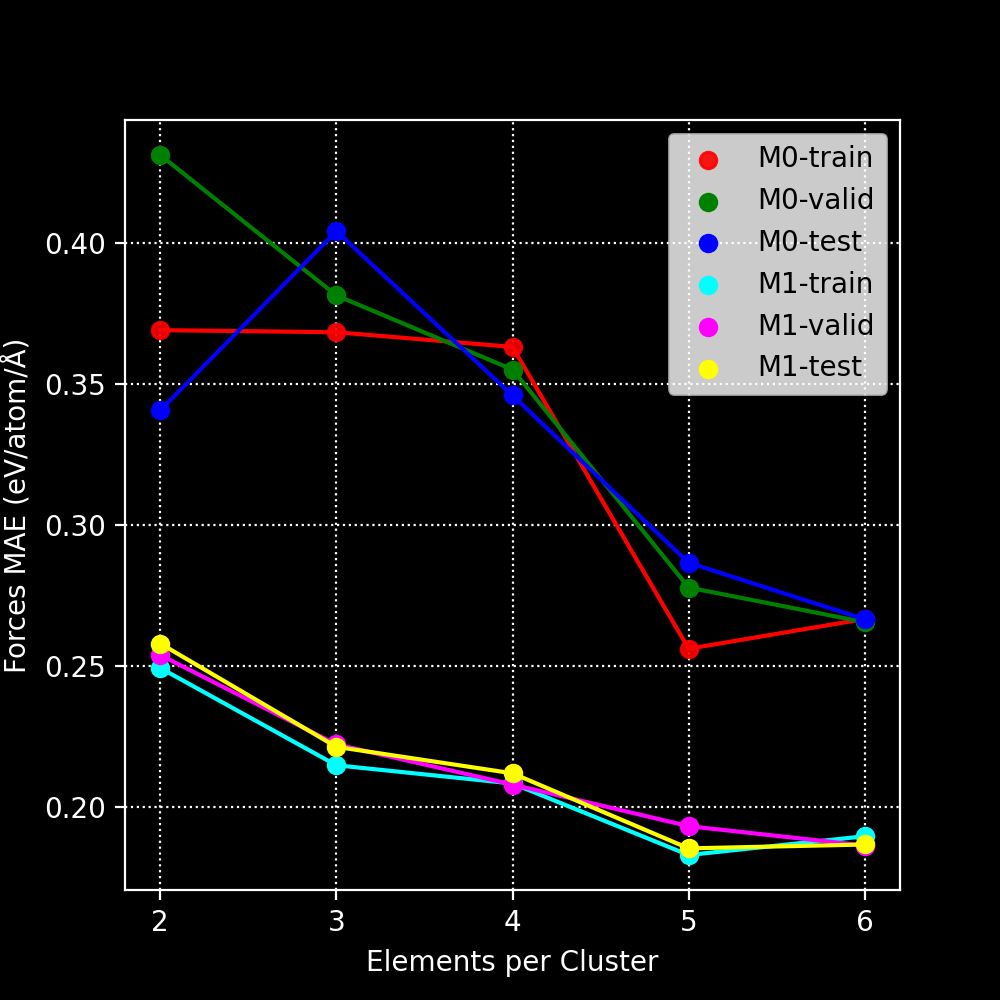
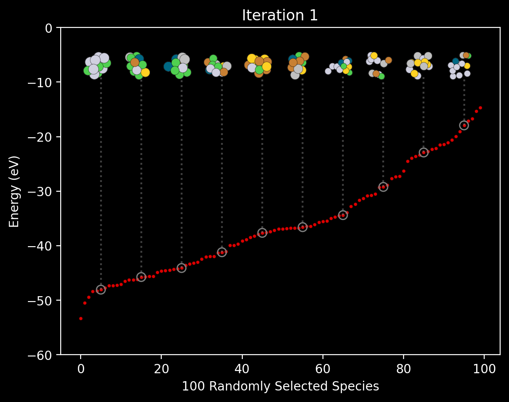
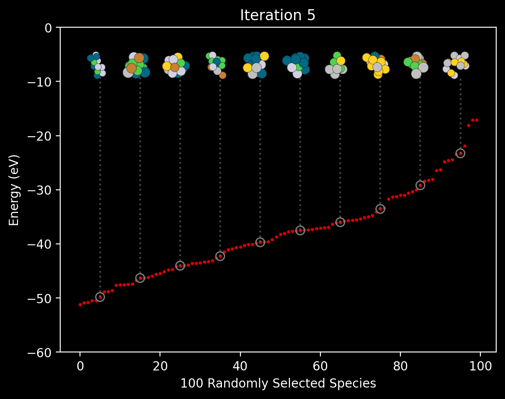
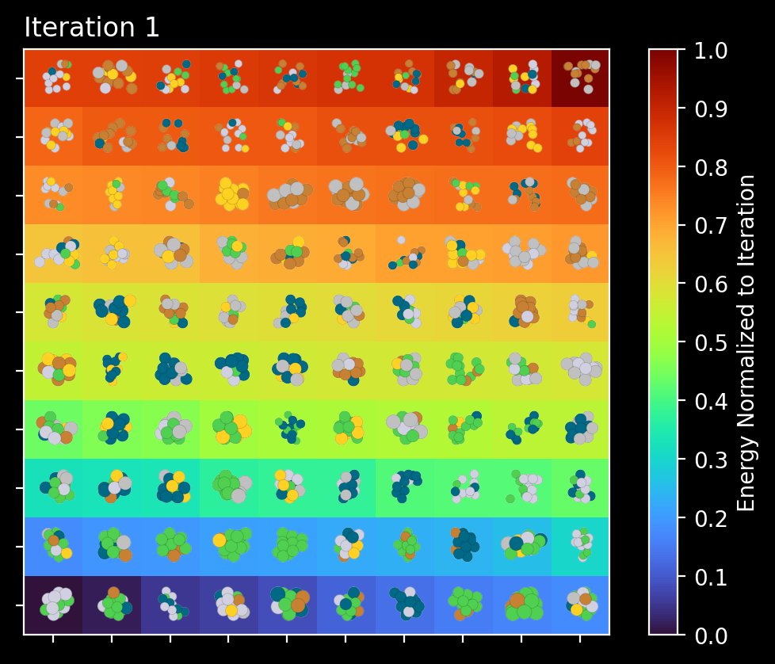
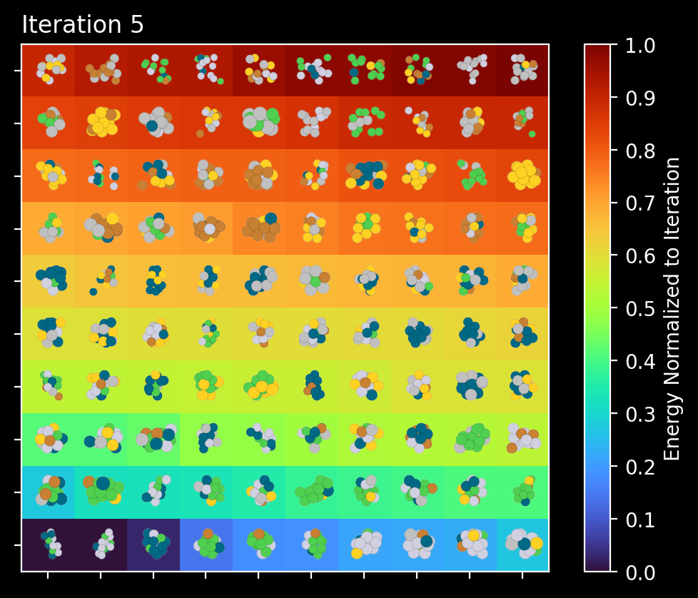
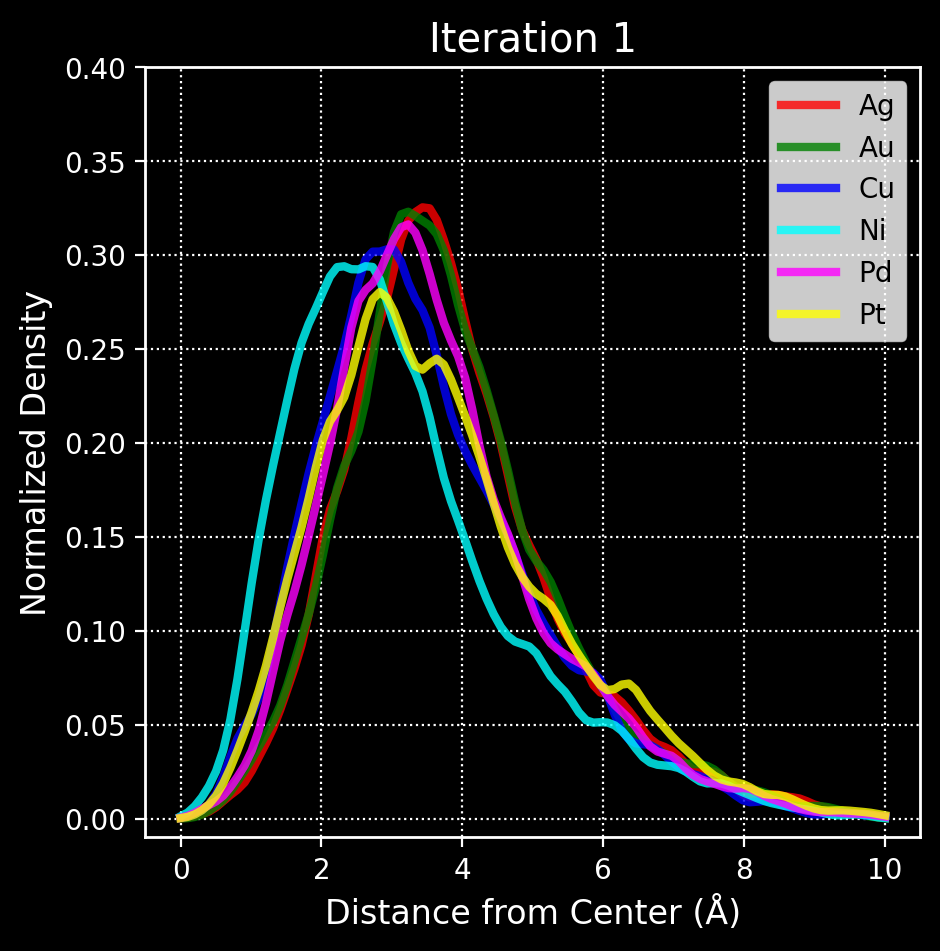
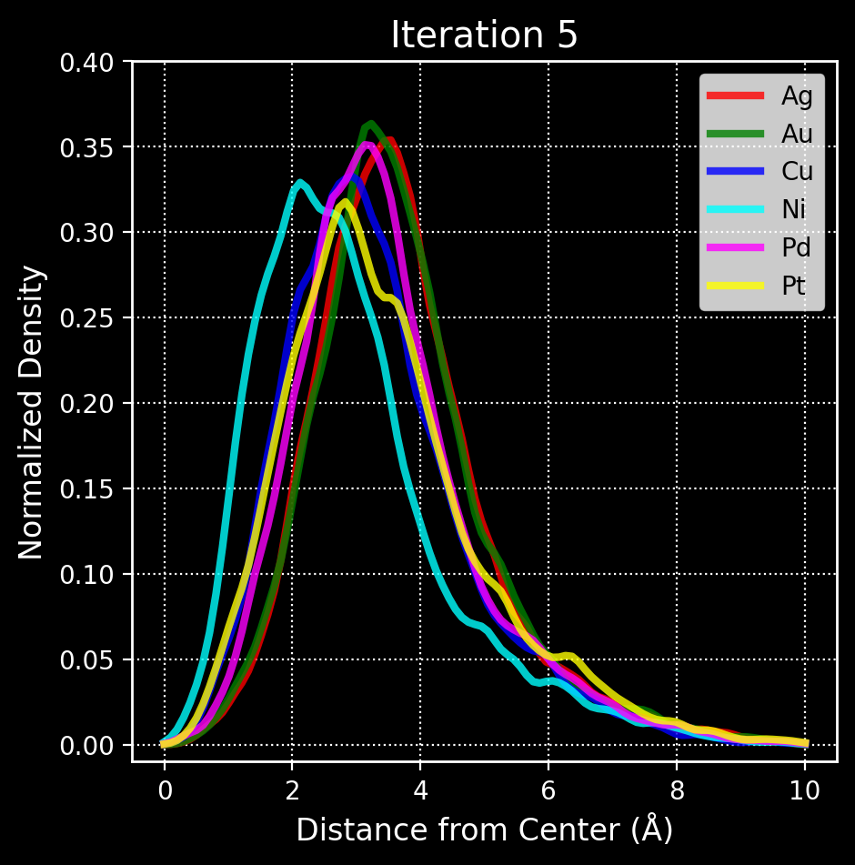

## Here we showcase how the self-optimizer can be put to use for 'high entropy' states.
These states are comprised of multiple elements, and thus their composition, size, stoichiometry all together multiply the state space.
To explore spaces like this automatically, we employ the self-optimizer with minimal adjustment.
This time the neural networks are encoded with SchentPack (https://github.com/atomistic-machine-learning/schnetpack)

The genetic algorithm is encoded with atomic simulations environment, as is the database archetecture (https://gitlab.com/ase/ase)

### Here we see the energy and force predictions improving across meta and mesa loops.
The meta loop is the more familiar outer or 'global' iteration loop, which improves the NN and explores the configuration space simultanesouly. 
The mesa loop is the inner loop which iterates over the number of elements per cluster (entropy loop).

  

  

### Additionally we showcase the grid and path plots for configuration space visualizaton as they evolve per Meta loop.
Note here that clusters are not exactly to relative scale.

  

  

  

  

### Finally we show how these unbiased filtration and evolution processes can result in natural core shell segregations.
That is, certain bonds are stronger than others, leading to eventual excluding of weak bonds, and geometric partitioning of elements.

  

  

### All code written by anywallsocket@gmail.com
