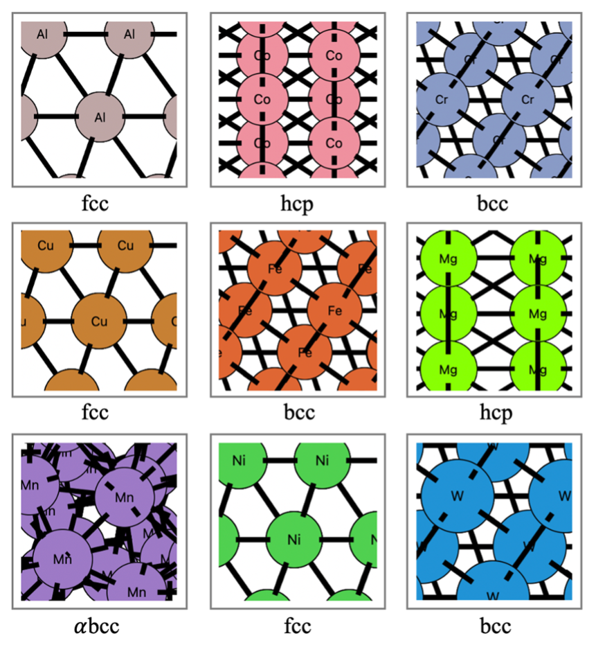
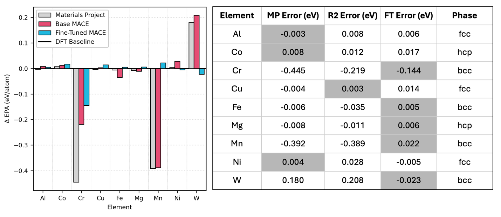
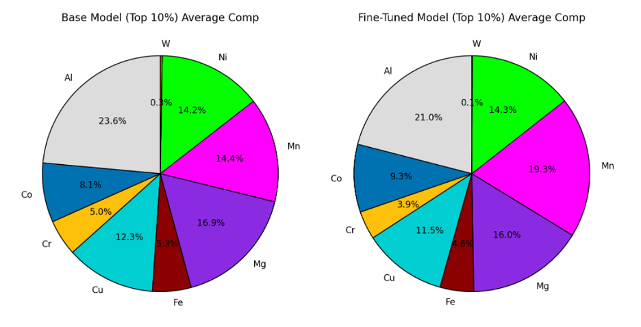
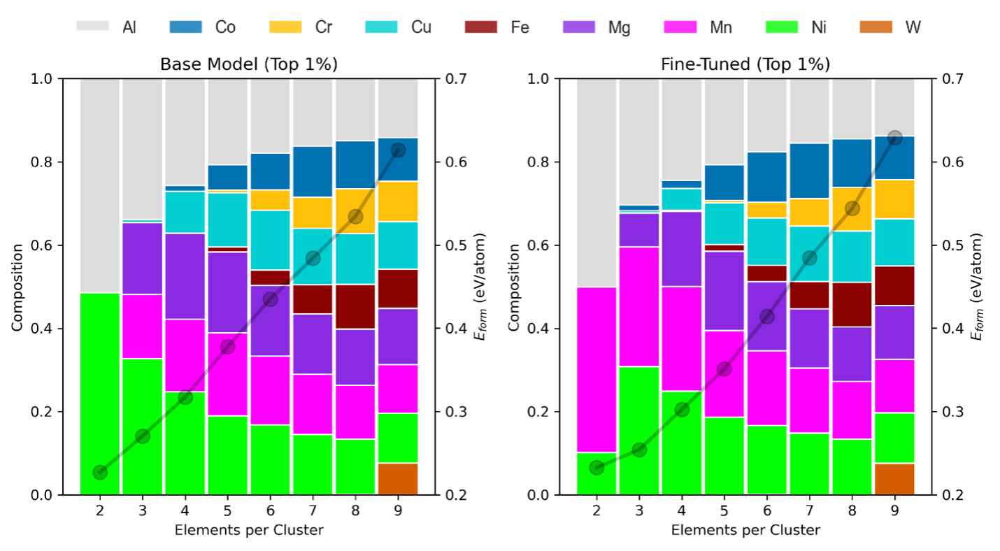
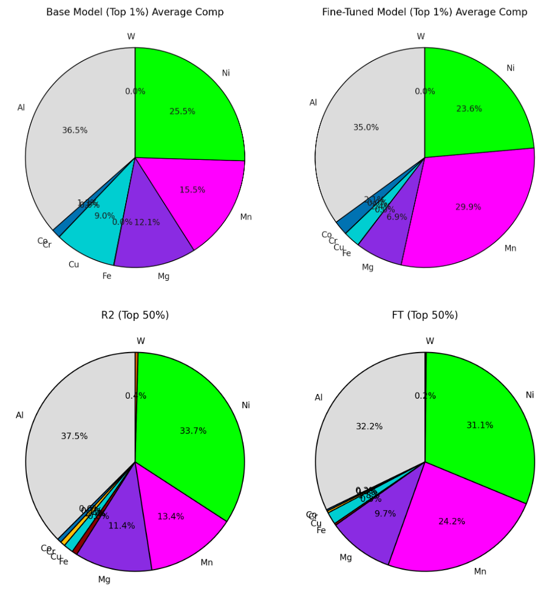
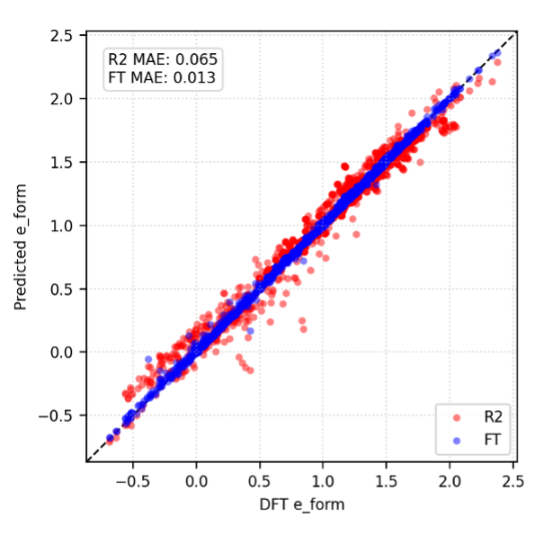
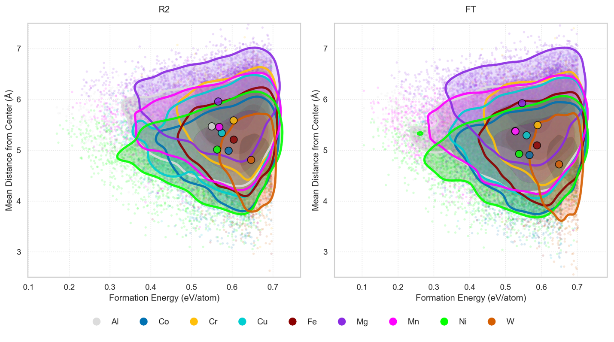

## Optimizing High-entropy Ratios for Formation Energy

#### Elements: Al, Co, Cr, Cu, Fe, Mg, Mn, Ni, W

[MACE] (https://github.com/ACEsuit/mace/tree/100a29149d90a5945eddec1f0940bd88a6e3b363) foundational model was fine-tuned at the $r^2SCAN$ level useing Density Functional Theory (DFT).

With this model we can explore the vast complexity space available to clusters of 50-150 atoms, with 2-9 elements per cluster. In total we investigate over 80,000 configurations, from which to extract statistical patterns useful to experimental material science.

<p align="center">
  
</p>

Figure 0. Bulk lattice references for our elements under consideration.

<p align="center">
  
</p>

Table 1. Model errors relative to our own DFT reference values. MP is Materials Project values,
R2 is the r2SCAN foundational model values, and FT is our fine-tuned model. Lowest absolute
errors are highlighted.

<p align="center">
  
</p>

Figure 1. Latest Fine-tuned model (FT), as compared with Base foundational model at the
r2SCAN level (R2). Hierarchy shows Al > (Mg, Mn) > Ni > Cu > Co > Cr > Fe > W, matching
previous.

<p align="center">
  
</p>


Figure 2. Isolated top 1% (roughly 1 00 clusters per entropy level) composition preferences.
Strong agreements, and the preference for Mg is seen to manifest at low entropy levels.

<p align="center">
  
</p>

Figure 3. Comparison between average compositions for randomized clusters (top) and genetic
algorithm, at various top percentages to reveal expected correspondence. Hierarchy matches:
Al > Ni > Mn > Mg > Cu > (Co, Cr, Fe, W).

<p align="center">
  
</p>

Figure 4. Relative parity plot for formation predictions against DFT values. Note that DFT
images are not necessarily totally relaxed, and hence we have some odd values.

<p align="center">
  
</p>

Figure 5. Core-shell analysis, revealing the statistical preferences for the top 10% for each
element as a function of its distance from the associated cluster’s geometric center. General
agreement between models is expected, revealing proximity:
W < Co < Ni < Fe < Cu < Mn < Al < Cr < Mg.

### Data Availability

Sample dataset for fine-tuning foundational model.

```
from ase.io import read

> test = read('compare_dft.xyz', index='0')

> test.info

{'DFT_e_form': np.float64(4.70381246),
 'DFT_epa': np.float64(-8.53788754),
 'R2_e_form': np.float64(5.169177119999999),
 'R2_epa': np.float64(-8.06962288),
 'FT_e_form': np.float64(5.113007698697668),
 'FT_epa': np.float64(-8.109292301302332)}

> test.arrays

{'numbers': array([27]),
 'positions': array([[10., 10., 10.]]),
 'DFT_forces': array([[-1.28e-04,  9.70e-05,  1.43e-04]]),
 'R2_forces': array([[0., 0., 0.]]),
 'FT_forces': array([[0., 0., 0.]])}

```


