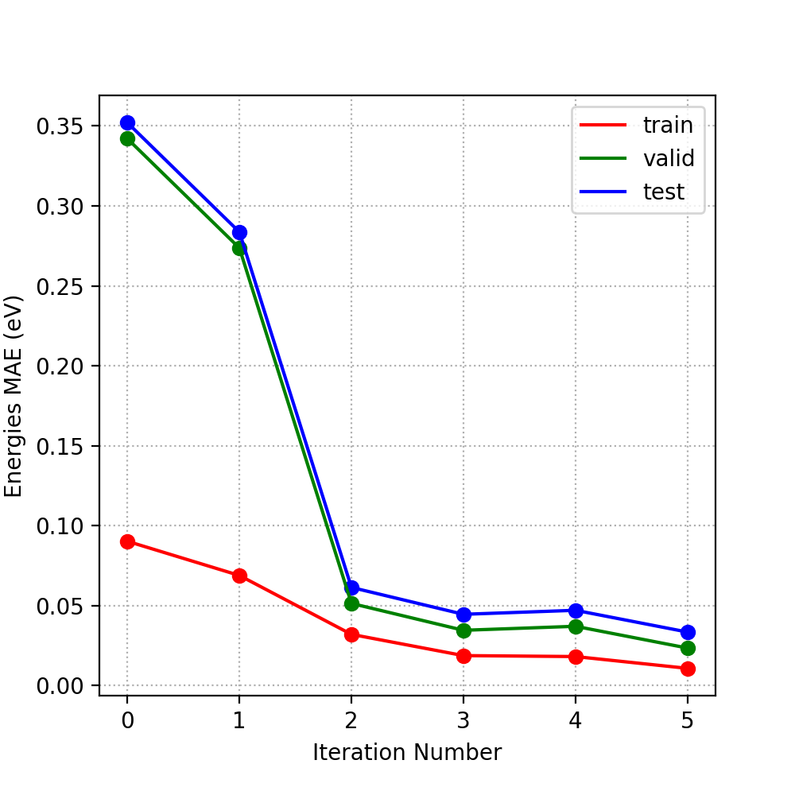
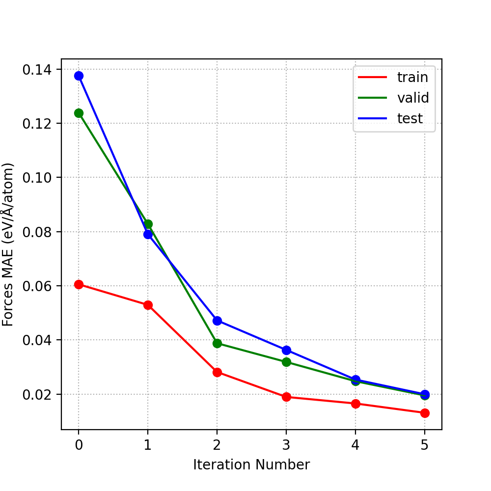

This self-optimizer explores the configuration space of 10 atom clusters as a demonstration with 6 possible elements.
The optimizer is intended to use bi-metals, whereas high-entropy applications would use more combinations.
This is based on the idea that bi-metals are sufficent for building a neural-network capable of predicting higher combinations.

Below we see the automatic and un-biased convergence of energy and force MAEs

  

  

This program also implements genetic inheritance, 
meaning structures generated in iteration i>0 are initialized by structures generated in iteration i-1.
