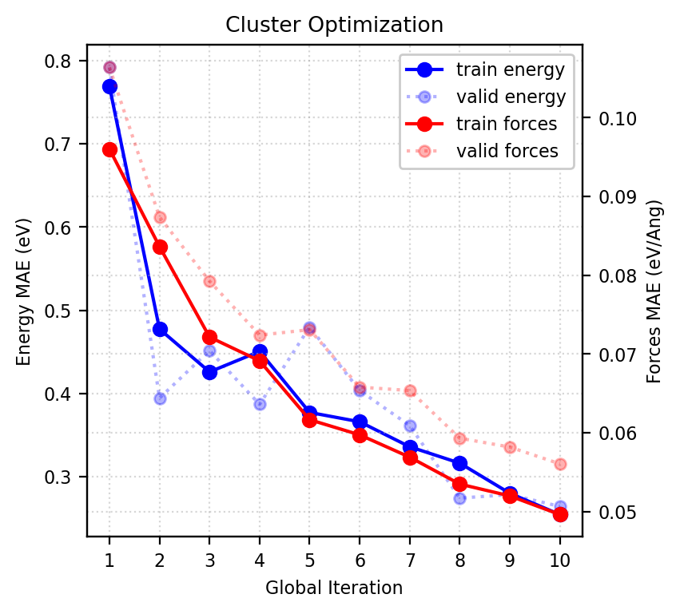
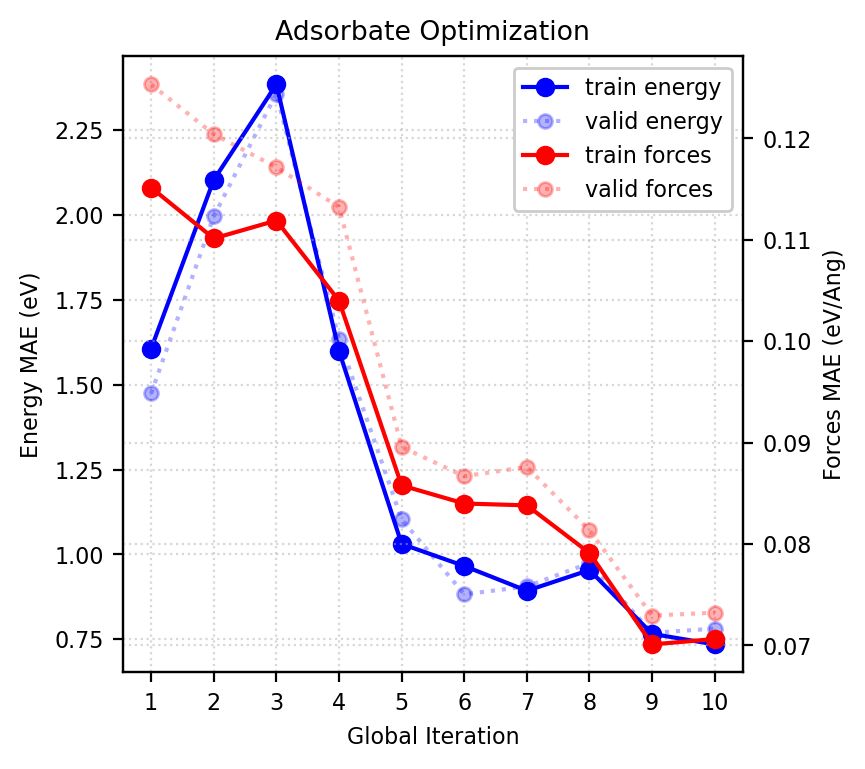

## Basic Active Learning Example
#### This time modified using a "Teacher-Student" training motif
#### Specifically we use the MACE [https://github.com/ACEsuit/mace] foundational model as "teacher"
#### And use our own MACE model, trained to capture this specific state space as the "student"
The genetic algorithm is encoded with atomic simulations environment, as is the database archetecture [https://gitlab.com/ase]

Each global iteration increases the size and sophistocation of the Student network
Roughly speaking, each loop takes
> 10m gpu
> 1 hour cpu

Improvements to foundational model are summarized below:

```
#550 images, sizes 10-20 atoms

#Teacher (float64 default model)
#6.0 it/s
#CPU times: user 5min 31s, sys: 59.8 s, total: 6min 31s
#Wall time: 1min 42s

#Teacher (float32 converted model)
#10 it/s
#CPU times: user 3min 7s, sys: 22.8 s, total: 3min 30s
#Wall time: 54 s

#Student (float32 default model)
#12.0 it/s
#CPU times: user 2min 38s, sys: 16.3 s, total: 2min 54s
#Wall time: 44 s
```

### Running 10 global iterations for the base clusters
<p align="center">
  
</p>


### Followed by 10 global iterations for the adsorbates
<p align="center">
  
</p>

### all code written by anywallsocket
